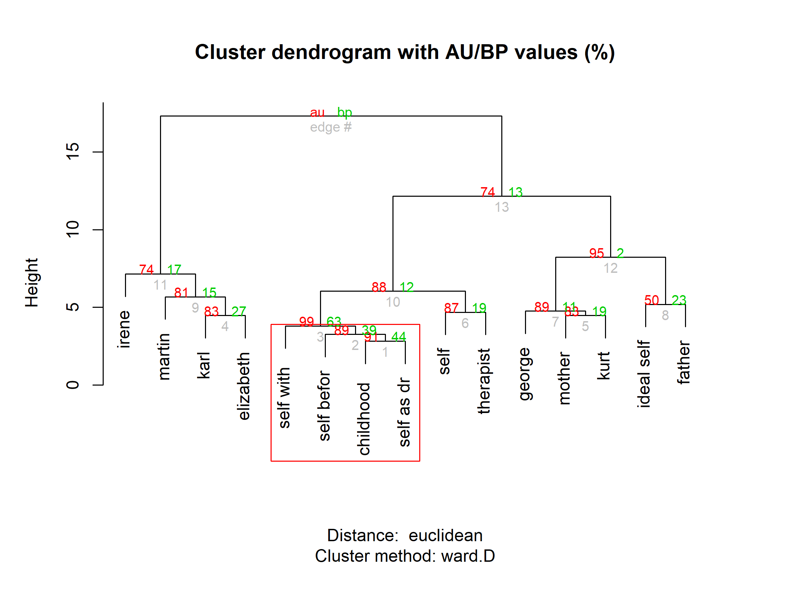

# Introduction

The [OpenRepGrid R package](https://cran.r-project.org/web/packages/OpenRepGrid/index.html) is part of the [OpenRepgrid project](http://openrepgrid.org/), which also comprises other softwares for repertory grids, for example [gridsampler](https://openresearchsoftware.metajnl.com/articles/10.5334/jors.150/) [@heckmann_gridsampler_2017].

# The Repertory Grid Technique 

The repertory grid is a data collection method which originated from *Personal Construct Theory (PCT)* [@kelly_psychology_1955]. It was originally designed as an instrument for use in psychotherapy to shed light on a client’s construction of the world. Over subsequent decades, the technique has been adopted in many other fields, including market, organizational, political, educational and sensory research [@fransella_manual_2004]. The repertory grid is a technique yielding *qualitative* and *quantitative* data. On the qualitative side, it allows collecting the repertoire of bipolar attributes (e.g. *smart vs. dull*, so called *constructs* in PCT terminology) an individual uses to make distinctions between entities of the world (e.g. different people, so called *elements* in PCT terminolgy). On the quatitative side, it rates each object on each elicited personal construct (e.g. Martin gets a score of 2 on the quarrelsome  = 1 vs. peaceful = 5 scale). The results of the data collection procedure is a constructs *x* elements matrix containing a rating score in each cell. Figure XXX shows a picture of a clustered repertory grid data set (see below for explanation). A thorough introduction to the technique is given by @fransella_manual_2004.

# Available Software

Software packages for the analysis of repertory grids have been developed since the 1960s [@sewell_computerized_1992] and several are available on the market today, e.g. Enquire Within [@mayes_enquire_2008], GridStat [@bell_gridstat_2009], GridCor [@feixas_gridcor:_2002], Idiogrid [@grice_idiogrid:_2002], Rep 5 [@gaines_rep_2009], GridSuite [@fromm_gridsuite_2006], rep:grid (Rosenberger, XXX). The range of analysis features they implement vary strongly. However, it is safe to state that no program comprises
all analysis features that have been devised in the literature. 

Focusing on the existing programs’ major drawbacks may best outline these goals:

* No grid software offers all methods of grid analysis that have been devised in the
  literature and that may be of interest to the user.
* None of the available grid programs can be extended by the user, i.e., the user
  cannot add or modify features.
* There is no computational framework integrated into the available grid programs to
  support experimental types of analysis.
* The output of most grid analysis programs does not easily lend itself to subsequent
  computation.
* There is no joint community effort to improve a grid program: The development
  and documentation is delegated to the software providers, and other users or researcher do not take
  ownership.
* A lack of broad participation in the software development leads to the problem of
  discontinued development once its initiators have moved on or retired.

The drawbacks listed above address not only the features of the grid software itself but
also the process of software development. Hence, the goals of the OpenRepGrid project go
beyond the mere implementation of analysis features. The OpenRepGrid project aims at
providing a means to move from a fragmented software development process to a more
collaborative approach in the field of grids. This goal has several prerequisites:
• Infrastructure and communication structures need to be set up to allow participation
in the project development.
• The software design must enable users to contribute to it.
These are common prerequisites in Open Source software development projects, which
thus may serve as an orientation for the OpenRepGrid project.

# Rationale

R was chosen as the language as it gets increasingly popular among academics. The open source nature of the R makes it poss 

An
example of this kind is the structural quadrant method, a method to assess construct system
complexity in grids, devised about 10 years ago by Gallifa and Botella (2000). This
approach has not yet been implemented in any of the available grid programs, hindering
further research and discussion of the method. The OpenRepGrid project may help to
reduce this obstacle. If researchers implement their ideas on the basis of the OpenRepGrid
package using the underlying R framework and make the code available on the Wiki,
it may help to facilitate the deployment of new methods in the research community,
leading to a radical reduction in time-to-market for new ideas. Once the code has been
tested and proper documentation has been added, it will immediately become part of the
OpenRepGrid package and can be used by all researchers interested in the method.

# Documentation 

R-help system. docu.openrepgrid.org

# Features

This article covers two selected features of the OpenRepGrid R package. An up-to-date, comprehensive overview of all implemented features can be found on the project’s doc page(docu.openrepgrid.org) or in the R package’s documentation files, accessible via the R help system.

Visualizations: Clustered Berin and Biplot, cognitive conflcit, implicative dilemma

Bertin bplots
Biplots
Clustering
Boostrap Cluster Analysis (Heckmann & Bell)
Correlations Distance measure, asymmetric measures like Somer's d
Sorting (angles, PC)
INdex measures: compleitxy, PVAFF, intensity

# Acknowledgements

A lot of thanks to the contributors and supporters of this package: Richard C. Bell, Alejandro García, and Diego Vitali.

# References

