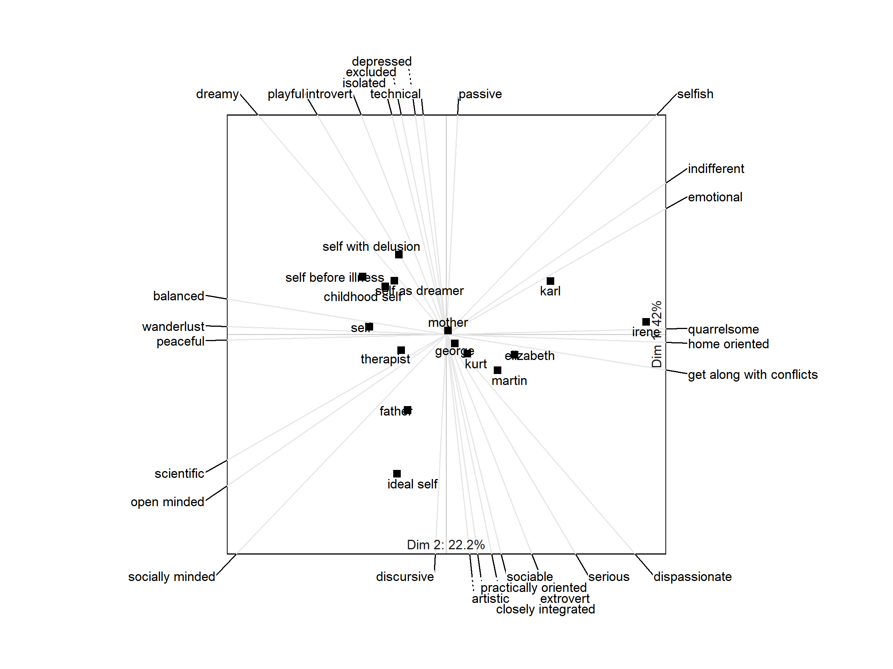
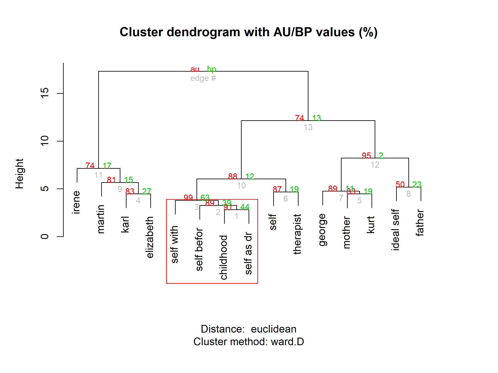

# Introduction

The [OpenRepGrid R package](https://cran.r-project.org/web/packages/OpenRepGrid/index.html) is part of the [OpenRepgrid project](http://openrepgrid.org/), which also comprises other softwares for repertory grids, for example [gridsampler](https://openresearchsoftware.metajnl.com/articles/10.5334/jors.150/) [@heckmann_gridsampler_2017].

# Repertory Grid Technique 

The repertory grid technique (RGT) is a data collection method which originated from *Personal Construct Theory (PCT)* [@kelly_psychology_1955]. It was originally designed as an instrument for psychotherapy to shed light on a client’s construction of the world. Over subsequent decades, the technique has been adopted in many other fields, including market, organizational, political, educational and sensory research [@fransella_manual_2004]. The data the RGT generates is *qualitative* and *quantitative*. On the qualitative side, it elicits the repertoire of bipolar attributes (e.g. *smart vs. dull*, so called *constructs* in PCT terminology) an individual uses to make distinctions between entities of the world (e.g. different people, so called *elements* in PCT terminolgy). On the quatitative side, it rates each object on each elicited personal construct (e.g. Martin gets a score of 2 on the quarrelsome  = 1 vs. peaceful = 5 scale). The results of the data collection procedure is a constructs *x* elements matrix containing a rating score in each cell. Figure 1 depicts a repertory grid data set, with the rows (constructs) and columns (elements) being clustered by similarity. A thorough introduction to the technique is given by @fransella_manual_2004.

# Available Software

While it is possible to work with repertory grids directly without further processing, it is common to submit grid data to statistical or mathematical analysis [e.g. @fransella_manual_2004]. For this purpose, software packages for the analysis of repertory grids have been developed since the 1960s [@sewell_computerized_1992]. Today, several softwares are available on the market, e.g. Enquire Within [@mayes_enquire_2008], GridStat [@bell_gridstat_2009], GridCor [@feixas_gridcor:_2002], Idiogrid [@grice_idiogrid:_2002], Rep 5 [@gaines_rep_2009], GridSuite [@fromm_gridsuite_2006], rep:grid [@rosenberger_vademecum_2015]. Despite the numerous software packages being available, several issues can be identified across the board: 

* No grid software offers all methods of grid analysis that have been devised in the literature. 
* None of the available grid programs can be extended by the user, i.e., the user cannot add or modify features. All listed softwares are closed source or at least not available in a public repository.
* There is no computational framework integrated into the available grid programs to support experimental types of analysis.
* The output of most grid analysis programs does not easily lend itself to subsequent computation.
* There is no joint community effort to improve a grid program: The development and documentation is delegated to the software providers, and other users or researcher do usually not participate in this process.
* A lack of broad participation in the software development leads to the problem of discontinued development once its initiators have moved on or retired.

# Package Rationale

The OpenRepGrid project was started with the idea of overcoming above mentioned issues. It was designed as an open source project allowing other researchers to contribute, for example, by implementing new features. R was chosen as the programming language as it runs on all major operating systems, gets increasingly popular among academics and is nowadays already taught to undergrads at many universities. The open source nature of R allows users to understand how functions (of grid analysis) are implemented. Also, R and most contributed packages are distributed under a copyleft license. This allows reseachers to use or modify existing code for their own needs and redistribute the code under the same license. In total, the obstancles to experimenting and contributing are significantly lowered compared to other softwares on the market. This bears another important benefit in terms of scientific progress. Currently, there appears to exist a substantial latency between publication of a new analysis method and it being made available to researchers as a software feature. For example, the *structural quadrant method* (SQM), a method to assess construct system complexity, devised almost 20 years ago by @gallifa_structural_2000 may serve as an example. The SQM has not been implemented in any grid program, hindering research and discussion of the method. The OpenRepGrid project may help to improve this situation. If the researchers decide to build their new method in R from the beginning on, adding the suggested method to the OpenRepGrid package will only be a small additional step. This will facilitate the dissemination of new methods in the research community, leading to a reduction in time-to-market for new ideas. Once the code has been tested and properly documentated, it can immediately become part of the OpenRepGrid package and can be used by all researchers.

Another reason for the choice of R is its growing ability to easily build graphical user interfaces using the shiny package [@chang_shiny:_2019] and other related packages. The PCP community is on average not well versed in programming. This translates into the need for easy to operate, GUI-based software. As shiny does not require knowledge of other web languages (e.g. CSS, HTML, JavaScript) to build a fully operational web application, R is also a suitable choice to fullfill this community need.

# Features

An up-to-date, comprehensive overview of all implemented features can be found on the project’s docs page (http://docu.openrepgrid.org.) and in the R package’s documentation files, accessible via [R Help](https://www.r-project.org/help.html). The implemented features include the following:

* *Data handling*: Importing and exporting grid data from different formats, sorting grids, several included datasets
* *Analyzing constructs*: Descriptive statistics, correlations, distances, PCA of construct correlations, cluster analysis, aligning constructs
* *Analyzing elements*: Descriptive statistics, correlations, distances, standardized element distances, cluster analysis
* *Visualization*: (Clustered) Bertin plots, biplots, clustering dendrograms
* *Indexes*: Intensity, complexity, PVAFF, measures of cognitive conflict, implicative dilemmas

In the remainder, three visualization features which are frequently used in publications are briefly outlined as examples. Figure 1 shows a Bertin diagram of a grid administered to a schizophrenic patient undergoing psychoanalytically oriented psychotherapy [@boker_reconstruction_1996]. The data was taken during the last stage of therapy. The data for this example is already included in the package. The ratings in the grid  are color-coded allowing to spot similar rating patterns. Also, the grid was submitted to cluster analysis, thereby reordering the constructs and elements by similarity as indicated by the dendrograms printed alongside the diagram.

Figure 2 shows a biplot of the grid data from Figure 1. A biplot is the generalization of a scatterplot from two to many axes, all displayed in a single plot. It allows reading off the approximate score of each element on each construct by projecting an element's position in the plot on the construct axes [@greenacre_biplots_2010;@slater_measurement_1976]. In the biplot, it can, for example, be seen that  "father" is the element construed most closely to "ideal self".

Figure 3 shows the element dendrogram, i.e. the result of a cluster analysis using Ward's method with a Euclidean distances measure. Using an approach suggested by @heckmann_new_2016, the dendrogram structures are also tested for stability. Stable or significant structures are framed by a rectangle, indicating that "childhood self", "self before illness", "self with delusion", and "self as dreamer" forms a stable group of elements.

A last example is 

# Acknowledgements

A lot of thanks to the contributors and supporters of this package: Richard C. Bell, Alejandro García, and Diego Vitali.

# References

